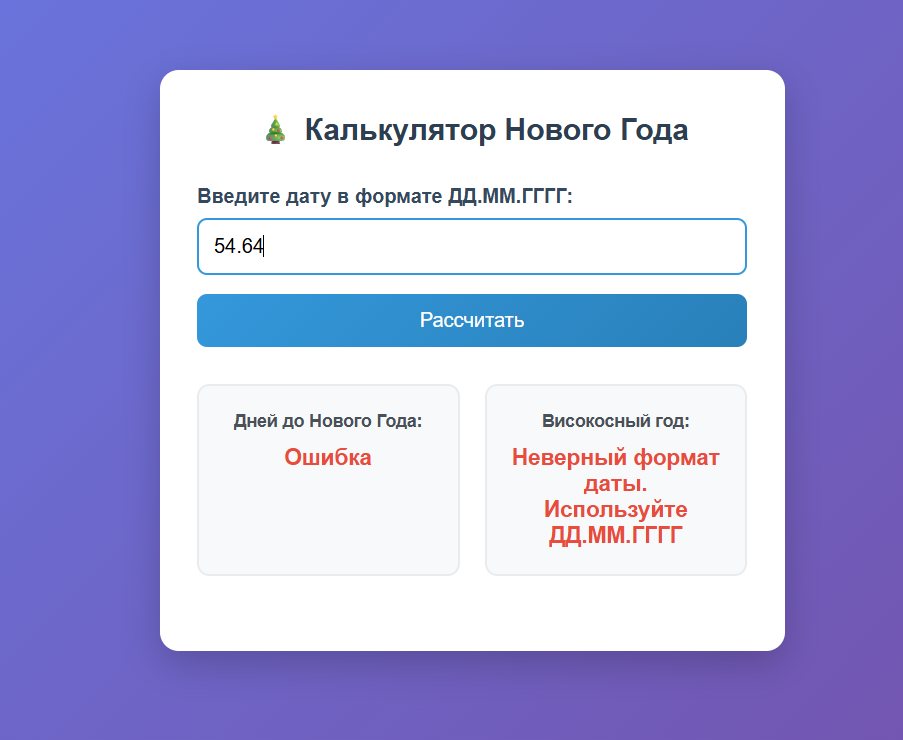
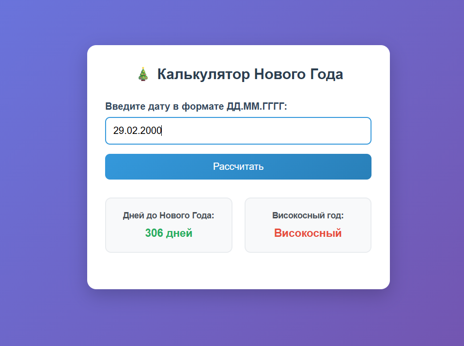
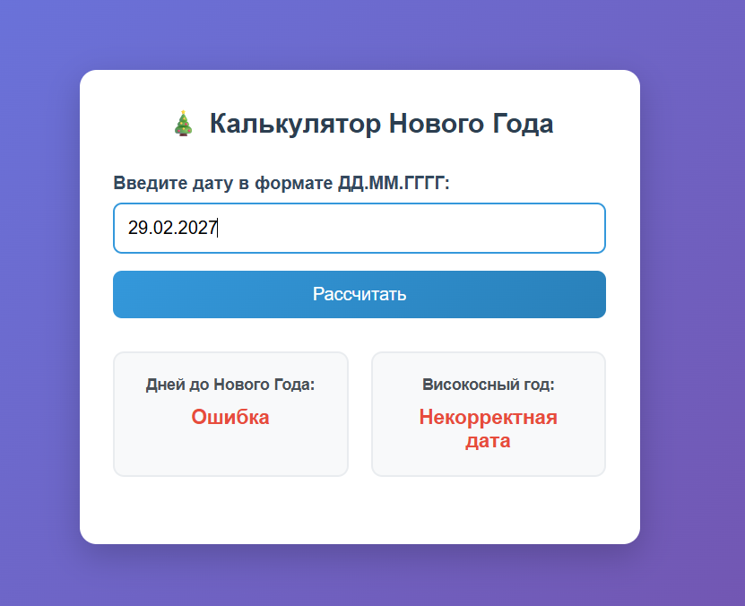

# 🎄 Калькулятор дней до Нового года

Веб-приложение для расчета количества дней до Нового года и проверки високосного года.

## 📋 Функциональность

- ✅ Расчет дней от введенной даты до Нового года
- ✅ Определение високосного года
- ✅ Валидация ввода даты
- ✅ Адаптивный дизайн
- ✅ Красивый интерфейс

## 🚀 Быстрый старт

1. **Скачайте файлы:**
   - `index.html`
   - `style.css` 
   - `script.js`

2. **Откройте в браузере:**
   ```bash
   # Просто откройте index.html в браузере
   open index.html

3. **Используйте:**
    Введите дату в формате ДД.ММ.ГГГГ
    Нажмите "Рассчитать"
    Получите результат в двух блоках

## 🛠️ Тестирование

1. **Проверка коректности даты**


2. **Некорректный ввод**



3. **Високосные годы**



