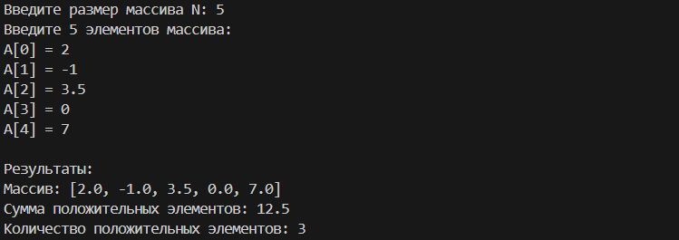
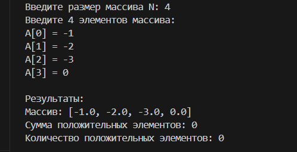

## Описание объектной модели

### Схема

### Структура данных:

N - целое число, размер массива

A - список вещественных чисел, исходный массив

sum_positive - вещественное число, накапливает сумму

count_positive - целое число, счетчик элементов

### Логика программы:

Ввод данных - проверка корректности ввода

Инициализация - обнуление переменных-аккумуляторов

Обработка массива - цикл с проверкой условия

Вывод результатов - форматированный вывод

## Тестовые примеры
### Тест 1: Нормальный случай
Вход: N = 5, A = [2, -1, 3.5, 0, 7]
Ожидаемый результат: sum = 12.5, count = 3
Вывод:

### Тест 2: Нет положительных элементов
Вход: N = 4, A = [-1, -2, -3, 0]
Ожидаемый результат: sum = 0, count = 0

Вывод:

### Тест 3: Все элементы положительные
Вход: N = 3, A = [1, 2, 3]
Ожидаемый результат: sum = 6, count = 3

Вывод:

### Тест 4: Пустой массив
Вход: N = 0, A = []
Ожидаемый результат: sum = 0, count = 0

Вывод:

