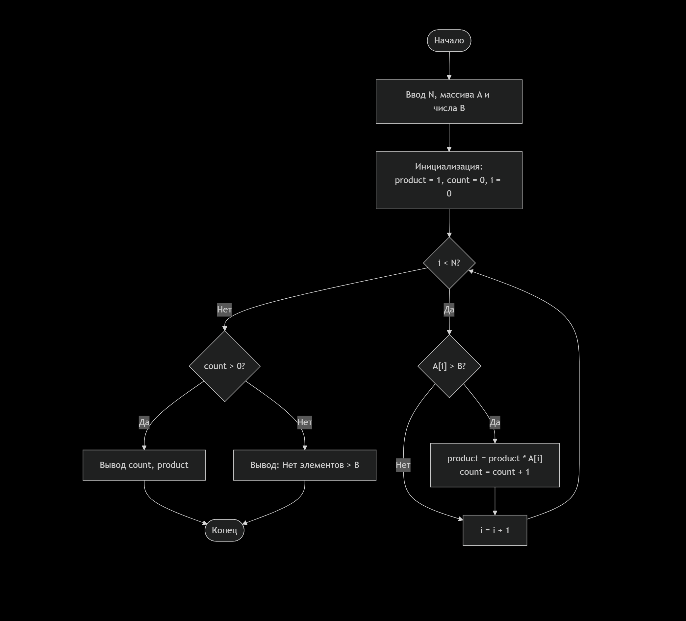
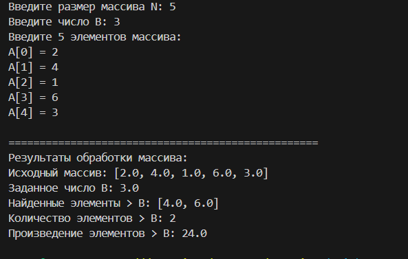
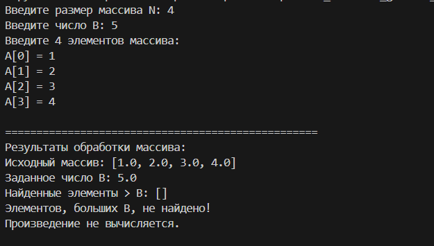
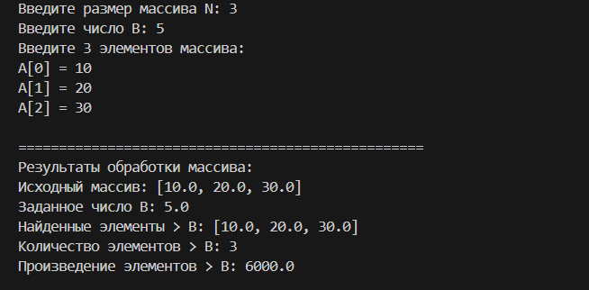
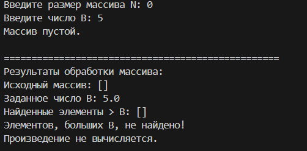
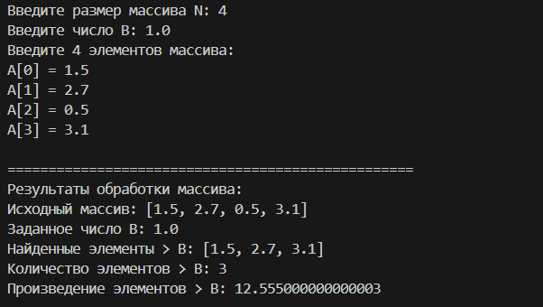

## Описание объектной модели
### Схема

### Структура данных:

N - целое число, размер массива

B - вещественное число, заданное для сравнения

A - список вещественных чисел, исходный массив

product - вещественное число, накапливает произведение (инициализируется 1)

count - целое число, счетчик элементов

found_elements - список, для отладки и вывода найденных элементов

### Логика программы:

Ввод и валидация - проверка всех входных данных

Инициализация - product = 1 (важно для умножения!)

Обработка массива - условие element > B

Условный вывод - разный вывод в зависимости от наличия результатов

## Тестовые примеры

### Тест 1: Нормальный случай
Вход: N = 5, A = [2, 4, 1, 6, 3], B = 3
Ожидаемый результат: count = 2, product = 4 * 6 = 24
Найденные элементы: [4, 6]

Вывод:

### Тест 2: Нет элементов больше B
Вход: N = 4, A = [1, 2, 3, 4], B = 5
Ожидаемый результат: "Элементов, больших B, не найдено!"

Вывод:

### Тест 3: Все элементы больше B
Вход: N = 3, A = [10, 20, 30], B = 5
Ожидаемый результат: count = 3, product = 10 * 20 * 30 = 6000

Вывод:

### Тест 4: Пустой массив
Вход: N = 0, A = [], B = 5
Ожидаемый результат: "Массив пустой." + "Элементов, больших B, не найдено!"

Вывод:

### Тест 5: С дробными числами
Вход: N = 4, A = [1.5, 2.7, 0.5, 3.1], B = 1.0
Ожидаемый результат: count = 3, product = 1.5 * 2.7 * 3.1

