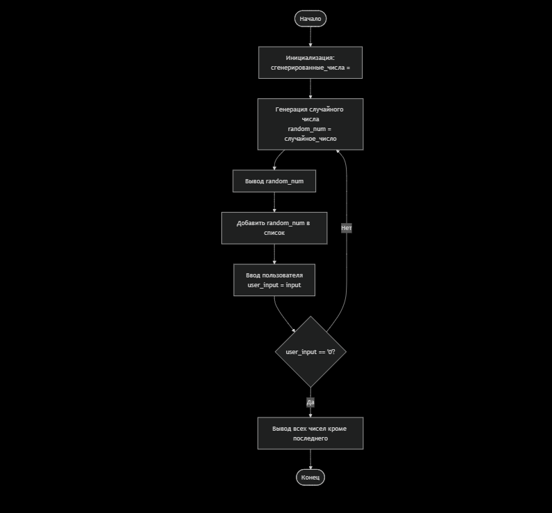
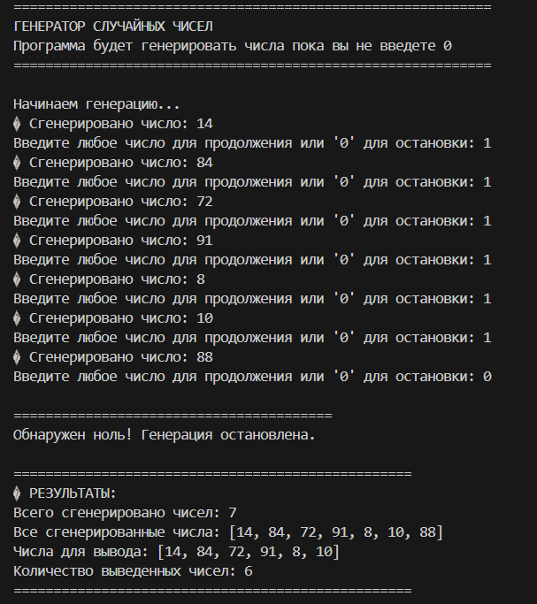
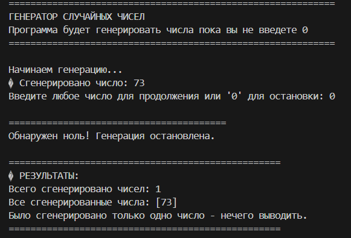

## Описание объектной модели

### Cхема

### Структура данных:

generated_numbers - список для хранения всех сгенерированных чисел

random_number - текущее сгенерированное число

user_input - ввод пользователя

sequence_count - счетчик количества итераций

### Логика программы:

Инициализация - пустой список для чисел

Бесконечный цикл - генерация чисел до команды остановки

Генерация случайного числа - random.randint(1, 100)

Ввод пользователя - проверка на '0'

Условие выхода - при вводе '0'

Формирование результата - все числа кроме последнего

## Тестовые примеры

### Тест 1: Короткая последовательность
Вход: 
Сгенерировано: 42 → Пользователь: 1
Сгенерировано: 15 → Пользователь: 0

Ожидаемый вывод: 
Все числа кроме последнего: [42]

Вывод:

### Тест 2: Длинная последовательность
Вход: 
Сгенерировано: 10 → Пользователь: 1
Сгенерировано: 20 → Пользователь: 1  
Сгенерировано: 30 → Пользователь: 1
Сгенерировано: 40 → Пользователь: 1
Сгенерировано: 50 → Пользователь: 1
Сгенерировано: 60 → Пользователь: 1
Сгенерировано: 70 → Пользователь: 0

Ожидаемый вывод:
Все числа кроме последнего: [10, 20, 30, 40, 50, 60]

Вывод:

### Тест 3: Одна итерация
Вход:
Сгенерировано: 99 → Пользователь: 0

Ожидаемый вывод:
Было сгенерировано только одно число - нечего выводить.

Вывод:

